#Abstract
Nowadays, loans are considered as a complex tool which serves both borrowers and investors. Loans can be divided into a large number of areas and components which determine its terms. Sometimes, due to their complexity, these terms are not clear to the borrower or even to the investor.  
As a result, the main questions that usually arise during loan creation are:

* Can the borrower repay the loan plus interest under loan conditions?  
* How long will it take?  
* What is the maximum loan amount that can be granted to a borrower?  

This report was made in order to get insights which might answer such questions or provide direction of research regarding loan uptake.

#Data-set information
This report shows data partial exploration of the [Loan dataset](https://www.kaggle.com/jschnessl/prosperloans) obtained from kaggle website and comes from the Prosper p2p lending platform.   
This exploration will focus on 9 of the 81 variables presented in this dataset:  

1. L.Months.Since.Originated - Number of months since the loan originated.  
2. L.Orig.Amount - The origination amount of the loan.  
3. L.Orig.Quarter - The quarter in which the loan was originated.  
4. Loan.Status - The current status of the loan: Cancelled/Chargedoff/Completed/Current/Defaulted/FinalPaymentInProgress/PastDue.  
5. Prosper.Rating - The Prosper Rating assigned at the time the listing was created: 0-N/A, 1-HR, 2-E, 3-D, 4-C, 5-B, 6-A, 7-AA.  
6. Prosper.Score - A custom risk score built using historical Prosper data. The score ranges from 1-11, with 11 being the lowest risk score.  
7. Borrower.Rate - The Borrower's interest rate for the loan.  
8. Borrower.State - The two letter abbreviation of the state of the address of the borrower.  
9. Stated.Monthly.Income - The monthly income the borrower stated at the time the loan was created.  


#Descriptive statistics
As a preliminary step the measures of central tendancy and dispersion are shown:

```
## 'data.frame':	113937 obs. of  9 variables:
##  $ L.Months.Since.Originated: int  78 0 86 16 6 3 11 10 3 3 ...
##  $ L.Orig.Amount            : int  9425 10000 3001 10000 15000 15000 3000 10000 10000 10000 ...
##  $ L.Orig.Quarter           : Factor w/ 33 levels "Q1 2006","Q1 2007",..: 18 8 2 32 24 33 16 16 33 33 ...
##  $ Loan.Status              : Factor w/ 12 levels "Cancelled","Chargedoff",..: 3 4 3 4 4 4 4 4 4 4 ...
##  $ Prosper.Rating           : Factor w/ 7 levels "A","AA","B","C",..: NA 1 NA 1 5 3 6 4 2 2 ...
##  $ Prosper.Score            : num  NA 7 NA 9 4 10 2 4 9 11 ...
##  $ Borrower.Rate            : num  0.158 0.092 0.275 0.0974 0.2085 ...
##  $ Borrower.State           : Factor w/ 51 levels "AK","AL","AR",..: 6 6 11 11 24 33 17 5 15 15 ...
##  $ Stated.Monthly.Income    : num  3083 6125 2083 2875 9583 ...
```

```
##  L.Months.Since.Originated L.Orig.Amount       L.Orig.Quarter 
##  Min.   :  0.00000         Min.   : 1000.000   Q4 2013:14450  
##  1st Qu.:  6.00000         1st Qu.: 4000.000   Q1 2014:12172  
##  Median : 21.00000         Median : 6500.000   Q3 2013: 9180  
##  Mean   : 31.89688         Mean   : 8337.014   Q2 2013: 7099  
##  3rd Qu.: 65.00000         3rd Qu.:12000.000   Q3 2012: 5632  
##  Max.   :100.00000         Max.   :35000.000   Q2 2012: 5061  
##                                                (Other):60343  
##                 Loan.Status    Prosper.Rating  Prosper.Score      
##  Current              :56576   C      :18345   Min.   : 1.000000  
##  Completed            :38074   B      :15581   1st Qu.: 4.000000  
##  Chargedoff           :11992   A      :14551   Median : 6.000000  
##  Defaulted            : 5018   D      :14274   Mean   : 5.950067  
##  Past Due (1-15 days) :  806   E      : 9795   3rd Qu.: 8.000000  
##  Past Due (31-60 days):  363   (Other):12307   Max.   :11.000000  
##  (Other)              : 1108   NA's   :29084   NA's   :29084      
##  Borrower.Rate       Borrower.State  Stated.Monthly.Income
##  Min.   :0.0000000   CA     :14717   Min.   :      0.000  
##  1st Qu.:0.1340000   TX     : 6842   1st Qu.:   3200.333  
##  Median :0.1840000   NY     : 6729   Median :   4666.667  
##  Mean   :0.1927641   FL     : 6720   Mean   :   5608.026  
##  3rd Qu.:0.2500000   IL     : 5921   3rd Qu.:   6825.000  
##  Max.   :0.4975000   (Other):67493   Max.   :1750002.917  
##                      NA's   : 5515
```

Preliminary examination shows that the dataset consists 113,937 loans.  
Moreover, average amount of loans is 8337$ and most of the loans are still active (not completed).  
It is also worth noting that most of the loans originated from California state.  
Furthermore, loan quarter variable shows also year information in addition to the quarter number. Hence in order to better handle this variable, it will be splitted into two separated columns: Loan.Quarter and Loan.Year.  

#Univariate Plots Section  
First step in data exploration is to analyze the frequency of each variable in order to find different directions of inquiry.

###Duration of Loans (Months since originated)  
According to the histogram below, duration of loans is most concentrated between 0-10 months.Also, this variable is somewhat skewed to the right. In order to better present such distribution it is common to transform such skewed data by log transformation (will not be applied here).
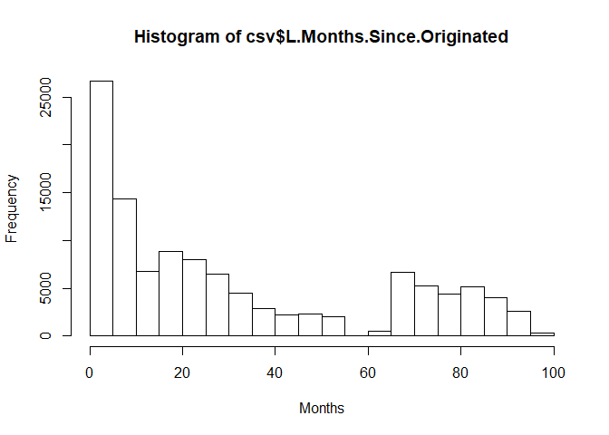<!-- -->

The calculations of skewness (0.75) and kurtosis (2.06) supports this finding. 

###Loan Original Amount  
To illustrate this data a boxplot was drawn:
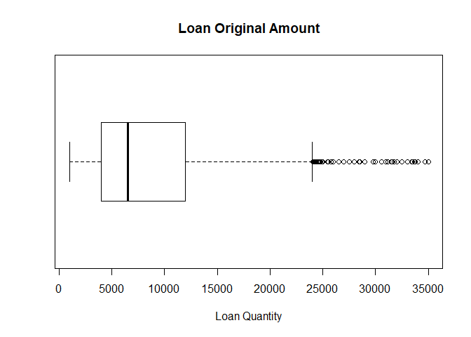<!-- -->

This boxplot shows that most loans are of size between 4000 and 12000 (lower and upper quartiles respectively). Also shown is the oulier points which are determined as the values above 1.5*interquartile range (IQR). These outlier values represent a group of loans which are unusual in their quantity and are much higher than the average amount.  

###Loan Quarter and Year
After dividing the original variable into two different variables it is easier to identify patterns of each factor:
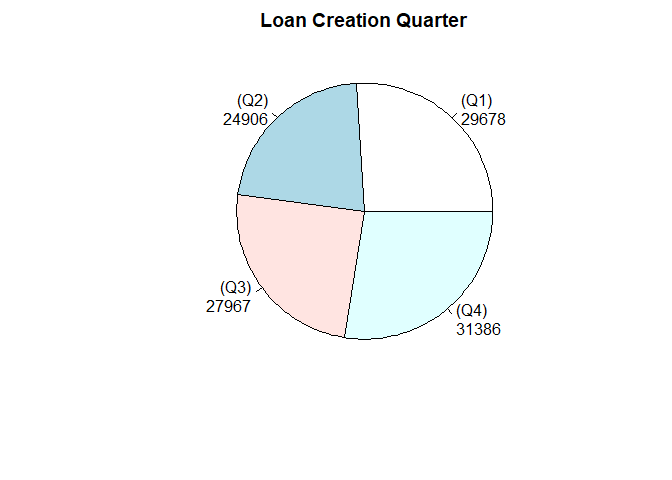<!-- -->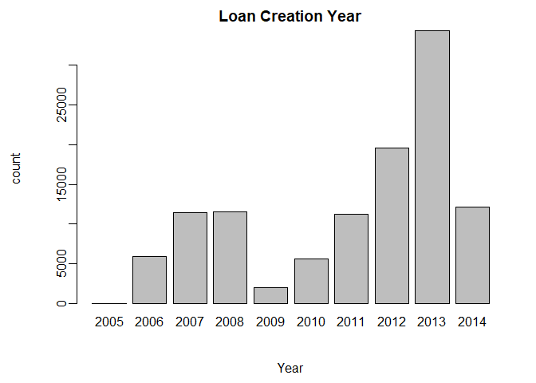<!-- -->

Quarter information shows that most loans are taken during the last quarter of the year. Given the year information, this statement can be misleading since a given year consists more or less observations than other years. 

###Loan Status  
This dataset contains information about the status of each observation (loan). The figure below shows that there are more than 1000 "current" status observations than its following "completed" status.
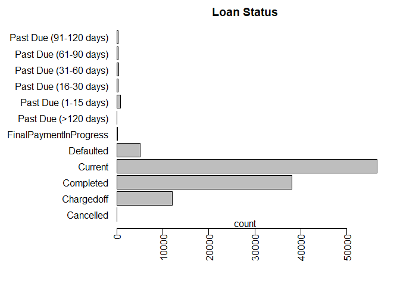<!-- -->

###Prosper Rating and Score  
The Prosper Rating is expressed as a letter grade that indicates the expected level of risk associated with a loan listing.  Each letter grade corresponds to an estimated average annualized loss rate range. Rating of AA is considered to be a loan with lowest risk.  
Prosper score on the other hand is a measure based on historical Prosper data and ranges from 1 to 11, with 11 being the best (lowest risk).
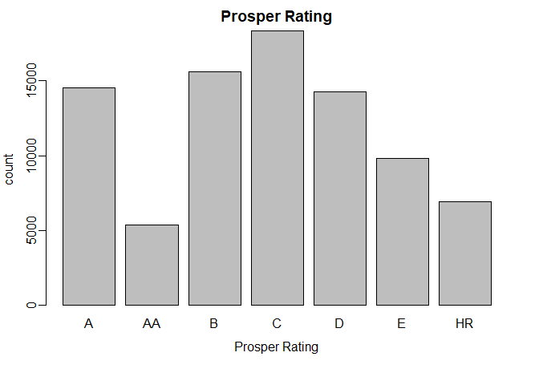<!-- -->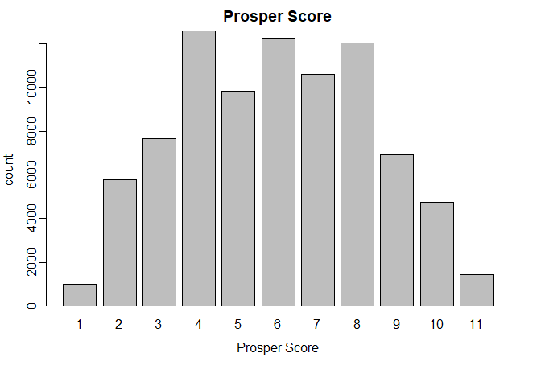<!-- -->

First impression is that both variables show somewhat normal distribution regarding the grade of rating and score of the loan - middle grading, logically, are the most abundant measure.

###Borrower Rate, State and Stated Monthly Income
Borrower Rate, as the interest rate at which money may be borrowed, is a crucial factor determining the total amount of money to be returned to the investor (usually the bank).  
Borrower State and Monthly Income may somewhat indicate the economic situation of the residents of each state.
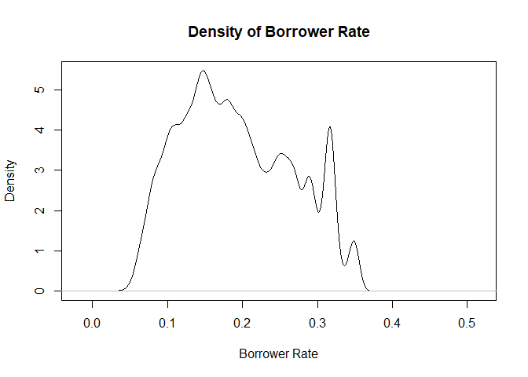<!-- -->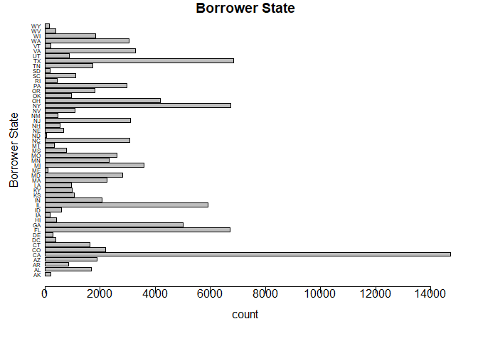<!-- -->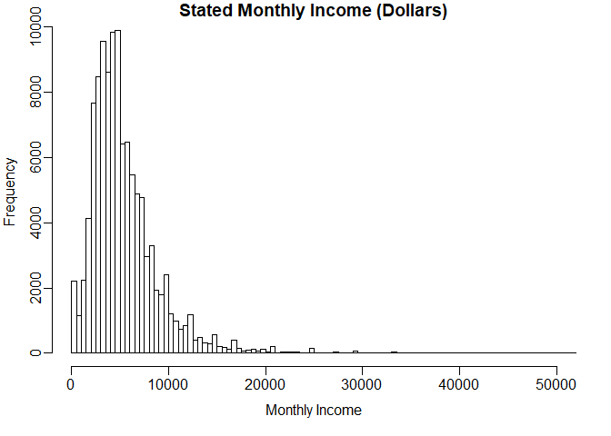<!-- -->

According to the plotted graphs we can see that borrower rate is mainly set between 0.1-0.2. The calculated average value is 0.19.  
Examination of the state data graph shows that California state contribute the largest amount of loans. The three next on the list are the states of Florida, New-York, and Texas.  
Since monthly income data are very spread, The histogram above shows only the bulk concentration of this variable (can be transformed by log transformation - was not applied here). It is clear that most borrowers have monthly income which ranges between 0-10000 dollars. The maximum recorded income is 1750003 dollars. Since the unusual monthly income values might be a result of typing error (or other errors), it will be wiser to take into account only the bulk values (between 0 and 25,000 dollars).

# Univariate Analysis
The following list is a summary of the findings from the descriptive and univariate plots sections:

* This extracted data set contains 9 variables with 113,937 observations (loans), from which 4 factors (of which one was divided into two) with different levels and 5 numeric variables.  
* Average duration of loan is ~32 months.  
* Average quantity of a loan is 8337$.  
* The market was mostly saturated with originated loans between 2012-2014 (alternatively, from 2009 the amount of loans increases each year - it appears that this data-set is updated to the first quarter of 2014).  
* Most loans are still active (were not completed).  
* Prosper Rating and Score are normally distributed according to their degree of levels.  
* Borrower data reveal interesting information regarding the nature and background of each recorded loan.  

# Research Purpose  
The objective of this study is to get insights regarding the nature of the loan market and by that, extrapolate those insights regarding the future or develop comprehensive models in future analysis.  


# Bivariate/Multivariate Plots Section and Analysis

In this section variables will be compared in order to find usefull correlations which may be used as a basis for construction of a model.
To get a clue regarding directions of investigation, a correlation matrix is constructed (only numeric quantitative variables) :

```
##                          row                column            cor
## 1              Prosper.Score         Borrower.Rate -0.64973616600
## 2              L.Orig.Amount         Borrower.Rate -0.32895994186
## 3  L.Months.Since.Originated         L.Orig.Amount -0.30905756354
## 4              L.Orig.Amount         Prosper.Score  0.26629334688
## 5              L.Orig.Amount Stated.Monthly.Income  0.20125946403
## 6  L.Months.Since.Originated         Prosper.Score  0.17761489749
## 7              Borrower.Rate Stated.Monthly.Income -0.08898179978
## 8              Prosper.Score Stated.Monthly.Income  0.08375665545
## 9  L.Months.Since.Originated Stated.Monthly.Income -0.08014726639
## 10 L.Months.Since.Originated         Borrower.Rate  0.02041956410
##                  p
## 1  0.000000000e+00
## 2  0.000000000e+00
## 3  0.000000000e+00
## 4  0.000000000e+00
## 5  0.000000000e+00
## 6  0.000000000e+00
## 7  0.000000000e+00
## 8  0.000000000e+00
## 9  0.000000000e+00
## 10 5.456080032e-12
```

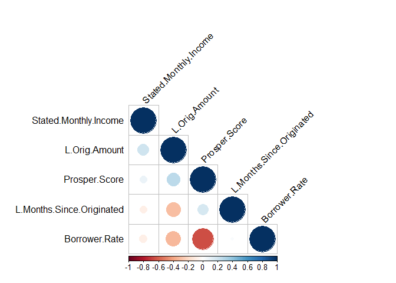<!-- -->

According to the output -  highest correlation that was detected is between Borrower Rate ~ Prosper Score with value of -0.65 (negative correlation). Other two negative correlations are Loan Amount ~ Borrower Rate and  Loan duration ~ Loan Amount. Additional positive correlations worth mentioning are Loan Amount ~ Prosper Score and Loan Amount ~ Stated Monthly Income. To summarize, there appear to be no strong correlation (correlation coefficient) between the quantitative variables.  

The next figures will attempt to show combined categorical data:
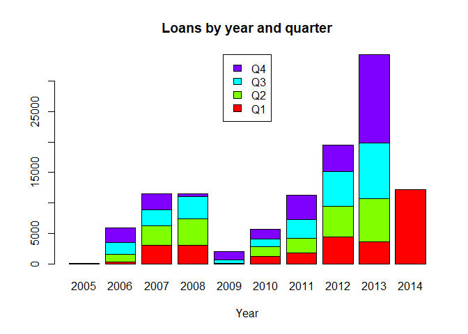<!-- -->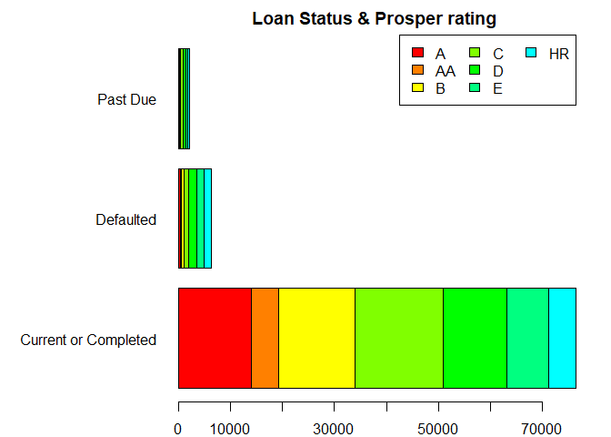<!-- -->

Combined categorical data show that loans are **NOT** created mosly at the forth quarter of each year (as mentioned earlier as a setback). Also prosper rating of the loans are divided similarly in each loan status (modified- Past due include all dues, Defaulted include also Chargedoff, and Current or Completed include all non-penalty loans).  

An attempt to examine some quantitative and categorical variables together will show several insights:
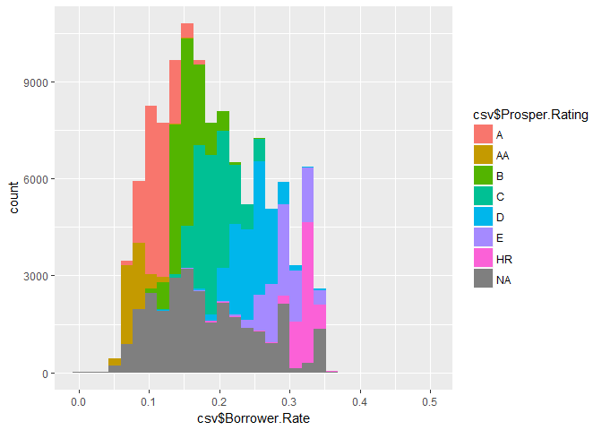<!-- -->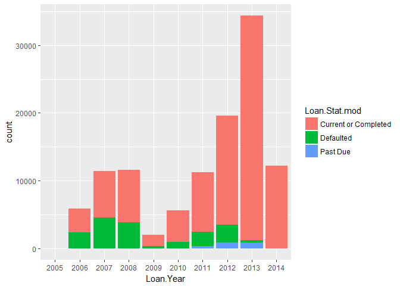<!-- -->

```
##                       
##                                  2005           2006           2007
##   Current or Completed 1.000000000000 0.606332543176 0.605235602094
##   Defaulted            0.000000000000 0.393667456824 0.394764397906
##   Past Due             0.000000000000 0.000000000000 0.000000000000
##                       
##                                  2008           2009           2010
##   Current or Completed 0.670360110803 0.848070346849 0.832802547771
##   Defaulted            0.329639889197 0.151929653151 0.165782024062
##   Past Due             0.000000000000 0.000000000000 0.001415428167
##                       
##                                  2011           2012           2013
##   Current or Completed 0.782686141788 0.821306193423 0.964740136847
##   Defaulted            0.191040256502 0.134097069503 0.009841316058
##   Past Due             0.026273601710 0.044596737074 0.025418547096
##                       
##                                  2014
##   Current or Completed 0.998439040421
##   Defaulted            0.000000000000
##   Past Due             0.001560959579
```

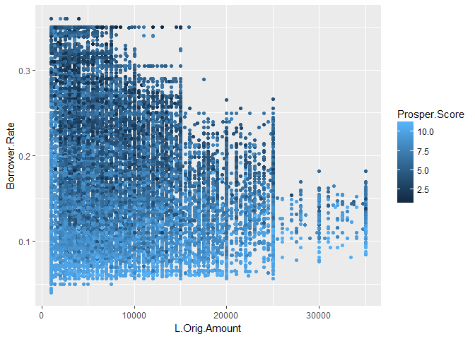<!-- -->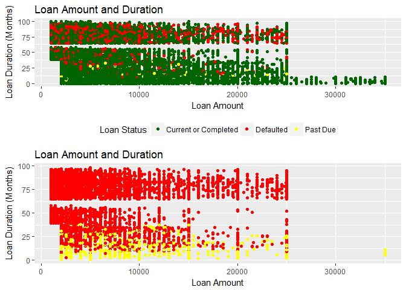<!-- -->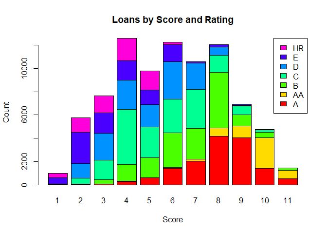<!-- -->

###Insights:  
* Borrower Rate ~ Prosper Rating: It seems that low prosper rating is resulting in higher borrower rate (this conclusion may not be intuitive since it depends on the method of determining each parameter).  
* Year~Status: ignoring year 2014 (assuming it has only first quarter data, as mentioned above), it can be seen that each year since 2011 has lower percentage of defaulted loans. Also, this percentage was below 2% since 2009.  
* Loan amount ~ Borrower Rate (grouped by ProsperScore): logically, lower borrower rate together with lower loan amount are considered as safer loans to approve and hence in such situations the prosper score is tending to be higher.  
* Loan amount ~ Loan duration (grouped by Loan status): It is clear that all recorded loans are divided into two big groups based on their duration. the nature of this division is unclear (why no existance of loans with ~60 months duration ?). Moreover, by excluding the "Current or Completed" loans its easy to see that "Past Due" loans are concentrated only in the lower group (which is somewhat logical).  
* Loan score ~ Loan rating: It is clear that both variables are connected to each other. Lower score corresponds with lower rating.  

# Final Plots and Summary  

### Plot One  
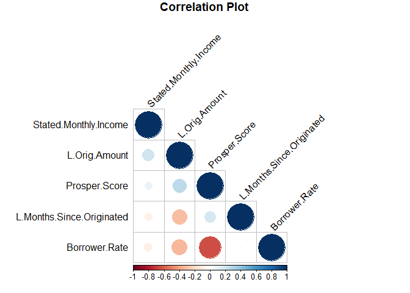<!-- -->

### Description One  
Exploration of the quantitative variables showed that Borrower Rate, in relation to the other variables, is correlating best with Prosper Score. this correlation value is approximately -0.65 which indicate a negative moderate correlation. From general point of view it can be said that one variable is determined by the other. Such relation, in light of the correlation value, might be also affected by other variable/s.

### Plot Two  
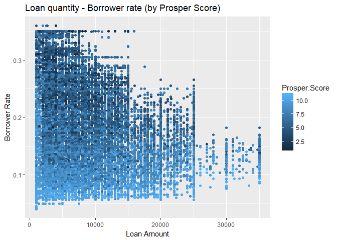<!-- -->

### Description Two  
This plot is the number of new loans originated each year and the final disposition of those loans. The early year of Prosper were marked by very low lending standards. Coupled with the global financial crisis, these early loans had very high default rates and many investors had losses. Only after 2011, the proportion of the defaulted loans was decreasing suggesting that lessons were learned after the global financial crisis.  
In addition, every year since the global crisis (2009) is characterized in greater quantity of loans. In view of this, 2014 is expected to contain more loans than its predecessors (and also the years afterwards, assuming no emerge of another economic crisis).

### Plot Three  
<!-- -->

### Description Three  

It is unclear why the Duration of the loans can be divided into two groups as mentioned above (no loans of duration around ~60 months). This artifact might be a result of recording procedure or a method regarding the insertion of the loan duration into the data-base. Another observation is that the smallest amounts of loans are prolonging more time than expected/usual. Also, while excluding Current/Completed loans it is clear that "Past Due" loans exist only in the lower duration group. This absence may indicate a delicate approch of the lenders about their return payments (long-planned loans will change status directly from current to defaulted, giving the benefit of the doubt in the middle cases).

------

# Reflection  

The Prosper Loan dataset consists 113,937 loans filled with different data. In order to get meaningful insights about this dataset it is very important to understand each field of data specifically and the whole domain generally. Choosing the suitable variables which will give insights once compared to other variables seems to be a very crucial step in the data analysis. The extraction and preparation of the data is also an important step, on which data will be ready to be analyzed. In this case, the choice of variables is deficient, leading to the lack of meaningful insights.  
However, there are several arguments that can be raised considering the data analyzed:  

1. The variables: Prosper rating, Prosper score, and Borrower rate are connected to each other in a way that one variable can be evaluated based on the other two variables. To better understand such relationships, a further comprehension of the definition of each variable is required. The same claim is valid also for Loan score and rating which show similar relationship.   
2. The world is advancing in its demand to loans and their capability to be completed, especially after the 2009 crisis, which led to an effort to verify borrower?s information before granting a loan.  
3. The loan original amount does not affect on the capability of the borrower to return it plus interest. Defaulted loans are not subjected to specific range of amount.  
4. This analysis is clearly the tip of the iceberg of the possible analysis options on this data base. Therefore further studies required in order to uncover additional relationships and thus to develop models that can predict the nature of future loans.

